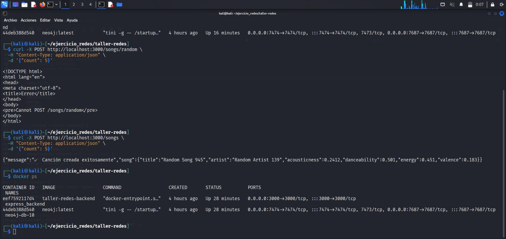
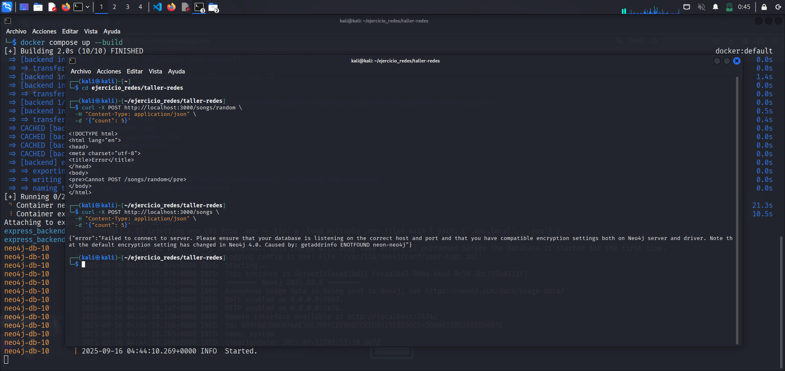
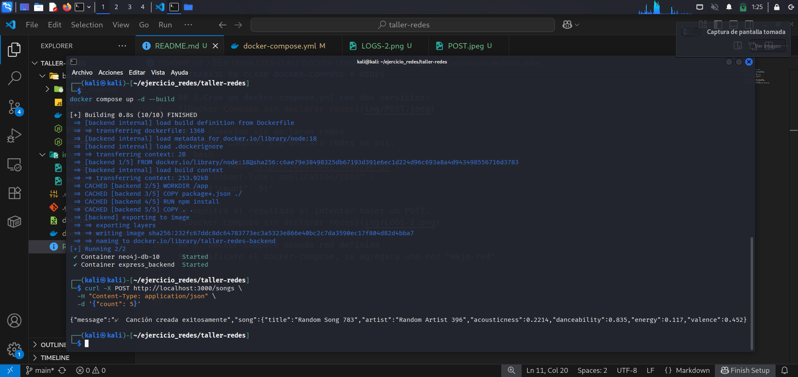

# TRABAJO EN CLASE DOCKER-COMPOSE Y REDES

## 1.Cree un docker-compose.yml con dos servicios:


## 2. Conexion sin declaran redes
El docker-compose sin declara redes se asi: 
```yaml
volumes:
  neo4j_data:

services:
  neon-neo4j:
    image: neo4j:latest
    container_name: neo4j-db-10
    restart: always
    environment:
      - NEO4J_AUTH=${NEO4J_USERNAME}/${NEO4J_PASSWORD}
    ports:
      - "7474:7474"
      - "7687:7687"
    volumes:
      - neo4j_data:/data
    network_mode: bridge 

  backend:
    build: ./backend
    container_name: express_backend
    restart: always
    env_file:
      - .env
    ports:
      - "${EXPRESS_PORT}:3000"
    volumes:
      - ./backend:/app
    depends_on:
      - neon-neo4j
    network_mode: bridge 

```
Se ejeutara la intruccion POST de la siguiente manera:
```bash
$ curl -X POST http://localhost:3000/songs \       
  -H "Content-Type: application/json" \
  -d '{"count": 5}'
```
Se muestra el resultado al intentar hacer un POST.


## 3. Docker-compose usando red definida
Se modificara el docker-compose, se agregara una red "majo-red"

El docker-compose declarando la red, se ve asi: 
```yaml
volumes:
  neo4j_data:

networks:
  majo-red: 
    driver: bridge
services:
  neon-neo4j:
    image: neo4j:latest
    container_name: neo4j-db-10
    restart: always
    environment:
      - NEO4J_AUTH=${NEO4J_USERNAME}/${NEO4J_PASSWORD}
    ports:
      - "7474:7474"
      - "7687:7687"
    volumes:
      - neo4j_data:/data
    networks:
      - majo-red 

  backend:
    build: ./backend
    container_name: express_backend
    restart: always
    env_file:
      - .env
    ports:
      - "${EXPRESS_PORT}:3000"
    volumes:
      - ./backend:/app
    depends_on:
      - neon-neo4j
    networks:
      - majo-red 
```
Se va a ejecutar la misma peticion POST y esta es la salida de la consola:


## REFLEXION
¿Qué red es mas practica para proyectos distribuidos distribuidos?, ¿Por qué?

La red definida por el usuario es más práctica porque permite que los servicios se comuniquen fácilmente entre sí, es más segura y facilita la gestión en proyectos grandes o distribuidos. Además, usar nombres de servicio en vez de IPs hace todo más sencillo.


